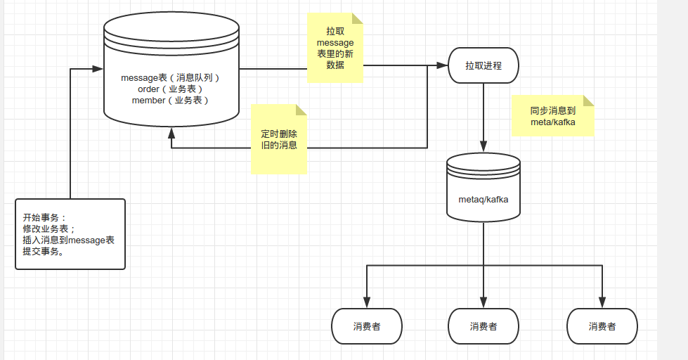
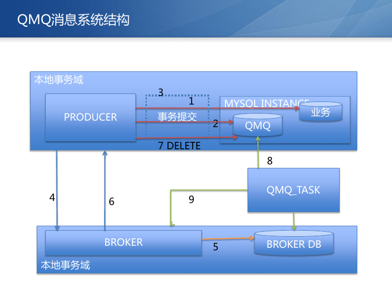

## 测试
测试以mysql里的一张来保存消息队列。

即在事务里，向message表里同插入一条数据，类似coreservice现有的wallet_log。

测试了
```
单表insert
单表insert + message

双表insert
双表insert+message

双表update
双表update+message

双表selectForUpdate
双表selectForUpdate+message
```

结果是:
```
增加插入到message表的一个操作，不会对事务有大影响。消息体如果大，则会造成比较大影响。
```

测试结果见testResult.md。

## 方案设计

目前DataChange是异步发送的，所以不能保证消息一定成功，所以不能用来做一些可靠的通知，或者补偿操作。

可以考虑这样的一个设计方案：

每张表，对应有一张消息队列。或者只有一个总的消息队列表。

在事务操作过程中，把重要的信息同时插入一个记录到消息队列表里。

由其它的进程，把消息队列表里的消息拉取出来，转到metaq/kafka里。




## 去哪儿网的QMQ消息系统

http://www.infoq.com/cn/presentations/qunar-java-development-environment 

pdf:
http://git.inzwc.com/zhixuan.chen/database-test/blob/master/pdf/qconbeijing-20140427am-sunli.pdf




